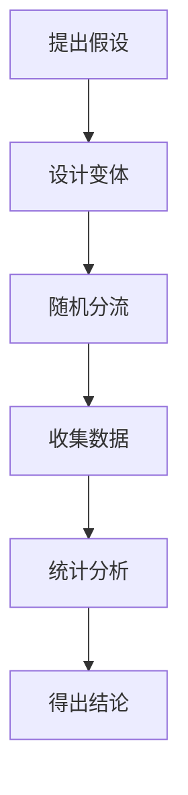

# A/B 测试

#tags: #市场营销 #数据分析 #A-B测试 #优化

## 概述

A/B 测试（分割测试）是一种对比测试方法，通过向不同用户群体展示不同版本，量化评估哪个版本效果更好。

## 测试流程

## 测试要素

### 可以测试的内容

- 标题文案
- CTA 按钮颜色/文字
- 页面布局
- 定价策略
- 邮件主题行
- 广告创意

### 统计显著性

- **置信度**：通常要求 95%
- **样本量**：确保足够的数据量
- **测试周期**：至少一个完整周期

## 最佳实践

1. **一次只测一个变量**：避免多重变量干扰
2. **设定明确假设**：预测结果和原因
3. **持续迭代**：测试→学习→改进
4. **关注商业指标**：不只是点击率

## 常见误区

- 过早停止测试
- 样本量不足
- 虚假相关
- 辛普森悖论

## 相关链接

- [[数字营销方法论]]
- [[转化率优化]]
