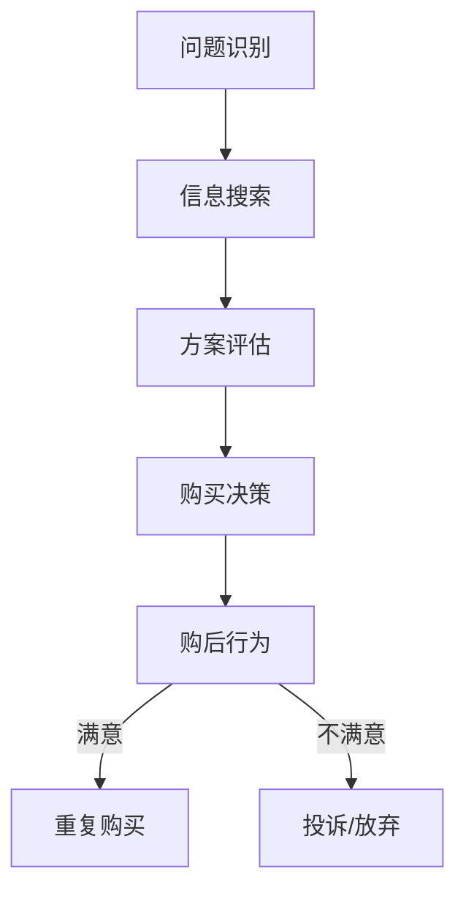

# 市场营销基础理论

创建日期：2026-03-09
#tags: #市场营销 #基础理论 #商业战略

## 概述

市场营销（Marketing）是企业通过创造、传递和沟通价值，满足目标客户需求并实现组织目标的一系列活动和过程。

---

## 核心概念

### 1. 市场营销定义

市场营销是**管理社会过程**，通过这个过程，个人和群体通过创造、提供和交换有价值的产品与服务，获得他们所需和想要的东西。

> **核心本质**：价值创造与价值交换

### 2. 营销管理哲学

| 哲学类型 | 核心思想 | 关注重点 |
|----------|----------|----------|
| [[生产观念]] | 顾客喜欢价格低且易获得的产品 | 生产效率、分销覆盖 |
| [[产品观念]] | 顾客喜欢质量最好、性能最优的产品 | 产品质量、功能改进 |
| [[推销观念]] | 顾客需要被说服购买 | 促销、销售技巧 |
| [[市场营销观念]] | 以目标顾客需求为中心 | 顾客需求、整合营销 |
| [[社会营销观念]] | 平衡企业利润、消费者需求、社会利益 | 三方利益平衡 |

---

## 营销环境分析

### 宏观环境（PESTEL）

- **P**olitical（政治环境）
- **E**conomic（经济环境）
- **S**ocial（社会文化环境）
- **T**echnological（技术环境）
- **E**nvironmental（自然环境）
- **L**egal（法律环境）

### 微观环境

- [[供应商]]
- [[营销中介]]
- [[顾客]]
- [[竞争者]]
- [[公众]]
- [[企业内部环境]]

---

## STP 战略

营销战略的核心框架，所有营销活动的基础。

### 1. 市场细分（Segmentation）

将异质市场划分为同质子市场的过程。

**细分维度**：

- **地理变量**：地区、城市规模、气候等
- **人口变量**：年龄、性别、收入、职业、教育等
- **心理变量**：生活方式、个性、价值观等
- **行为变量**：使用时机、追求利益、使用率、忠诚度等

### 2. 目标市场选择（Targeting）

评估各细分市场的吸引力，选择进入哪些市场。

**五种目标市场模式**：

1. 密集单一市场
2. 有选择的专门化
3. 产品专门化
4. 市场专门化
5. 完全市场覆盖

### 3. 市场定位（Positioning）

在目标顾客心目中占据独特位置。

**定位策略**：

- 属性定位
- 利益定位
- 用户定位
- 使用者定位
- 竞争者定位
- 产品类别定位
- 质量/价格定位

---

## 营销组合策略（4Ps → 7Ps）

### 传统 4Ps（产品营销）

| 组合要素 | 内容 |
|----------|------|
| [[产品（Product）]] | 产品质量、设计、品牌、包装、规格、服务等 |
| [[价格（Price）]] | 定价策略、折扣、付款期限、信用条件等 |
| [[渠道（Place）]] | 渠道覆盖、分销、物流、库存、选址等 |
| [[促销（Promotion）]] | 广告、公关、人员推销、销售促进等 |

### 服务营销 7Ps

在 4Ps 基础上增加：

| 新增要素 | 内容 |
|----------|------|
| [[人员（People）]] | 服务人员的素质、培训、形象 |
| [[过程（Process）]] | 服务流程、标准化、顾客参与度 |
| [[有形展示（Physical Evidence）]] | 服务环境、设施、工具、着装 |

### 4Cs（顾客视角）

- **Customer**（顾客需求）← Product
- **Cost**（顾客成本）← Price
- **Convenience**（便利性）← Place
- **Communication**（沟通）← Promotion

---

## 消费者行为理论

### 消费者购买决策过程

### 影响消费者行为的因素

1. **文化因素**：文化、亚文化、社会阶层
2. **社会因素**：参照群体、家庭、角色与地位
3. **个人因素**：年龄、职业、经济状况、生活方式
4. **心理因素**：动机、感知、学习、信念与态度

---

## 品牌理论

### 品牌资产模型（Aaker）

| 维度 | 说明 |
|------|------|
| 品牌知名度 | 顾客识别和回忆品牌的能力 |
| 品牌联想 | 顾客心中与品牌相关的一切事物 |
| 品牌忠诚度 | 顾客重复购买的程度 |
| 感知质量 | 顾客对品牌整体质量的评价 |
| 其他资产 | 专利、商标、渠道关系等 |

### 品牌定位策略

- [[功能性定位]]
- [[象征性定位]]
- [[体验性定位]]

---

## 营销调研

### 调研方法

| 方法 | 类型 | 适用场景 |
|------|------|----------|
| [[观察法]] | 定性 | 了解自然行为 |
| [[焦点小组]] | 定性 | 深度洞察需求 |
| [[问卷调查]] | 定量 | 大规模数据收集 |
| [[实验法]] | 因果研究 | 测试因果关系 |
| [[深度访谈]] | 定性 | 探索性研究 |

---

## 数字营销新趋势

### 内容营销矩阵

- [[博客文章]]
- [[视频内容]]
- [[社交媒体内容]]
- [[播客]]
- [[白皮书]]

### 数据驱动营销

- [[用户画像]]
- [[A/B测试]]
- [[转化率优化]]
- [[营销自动化]]

---

## 经典营销理论

| 理论 | 提出者 | 核心观点 |
|------|--------|----------|
| [[定位理论]] | Trout & Ries | 在心智中占据位置 |
| [[蓝海战略]] | Kim & Mauborgne | 开创无人争抢的市场空间 |
| [[长尾理论]] | Chris Anderson | 关注小众市场的聚合效应 |
| [[漏斗模型]] | St. Elmo Lewis | AIDA：注意-兴趣-欲望-行动 |
| [[RFM模型]] | - | Recency, Frequency, Monetary |

---

## 相关链接

- [[STP战略详解]]
- [[品牌管理实务]]
- [[数字营销方法论]]
- [[消费者心理学]]

---

## 参考文献

1. Kotler, P., & Keller, K. L. (2021). *Marketing Management*
2. Porter, M. E. (1985). *Competitive Advantage*
3. Trout, J., & Ries, A. (1981). *Positioning: The Battle for Your Mind*

---

*最后更新：2026-03-09*
*状态：待完善*
